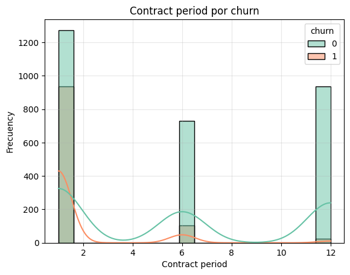
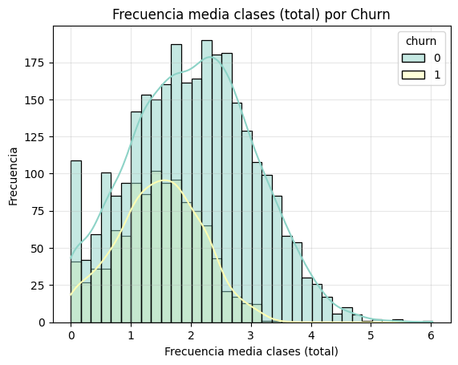
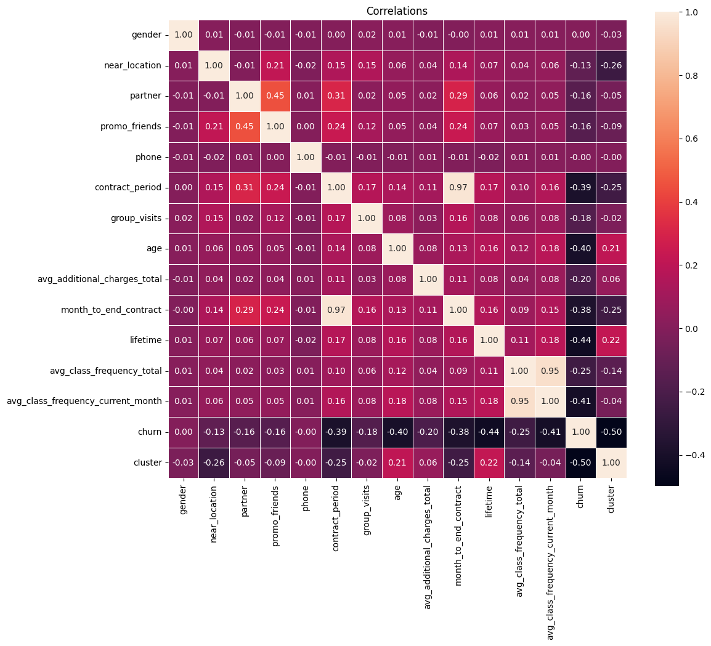
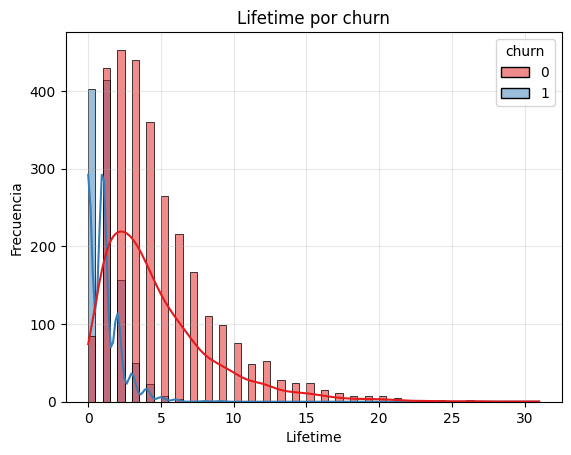
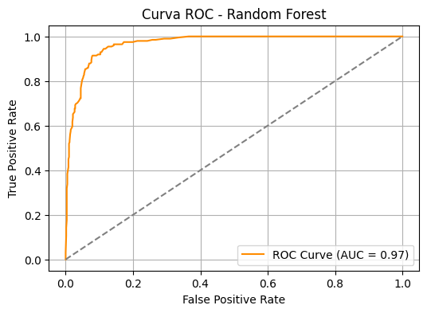
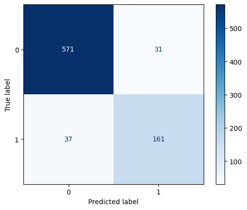
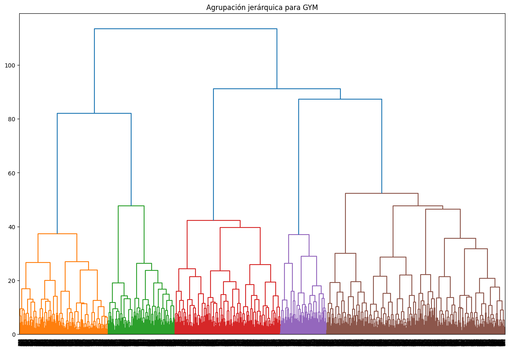

# 🏋️‍♂️ Predicción de Deserción de Usuarios en un Gimnasio con Machine Learning

Este proyecto utiliza técnicas de aprendizaje automático para predecir si un usuario de un gimnasio abandonará el servicio. A través del análisis exploratorio de datos, la ingeniería de características y el entrenamiento de modelos de clasificación, se busca proporcionar a la empresa una herramienta que le permita **anticipar la pérdida de clientes** y tomar decisiones proactivas para aumentar la retención.

---

## 📂 Contenido del Proyecto

- Análisis exploratorio de datos (EDA)
- Visualización de correlaciones e insights clave
- Limpieza y transformación de datos
- Entrenamiento y evaluación de modelos
- Interpretación de resultados
- Visualización de métricas clave

---

## 📊 Principales Gráficas

### **Comparación entre contrato y retención**
   > 📌 Estas gráfica muestra cómo varía la retención según el tipo de contrato.

  

### **Distribución de visitas semanales**
   > 📌 Permite observar la relación entre la frecuencia de asistencia y la probabilidad de cancelación.

  

### **Heatmap de correlaciones**
   > 📌 Indica las variables más correlacionadas con la cancelación de membresía.

  

### **Comparación entre duración y retención**
   > 📌 Resalta cómo el tiempo total como cliente afecta la probabilidad de permanencia.

  

---

## 🤖 Modelos de Machine Learning

Se entrenaron y compararon varios modelos para predecir la retención de usuarios:

- **Regresión Logística**
- **Random Forest**

> 📈 El modelo de Random Forest alcanzó una precisión destacada, identificando correctamente patrones de deserción con alta confiabilidad.

### 🎯 **Curva ROC - Random Forest**

  

### 🧮 **Matriz de Confusión - Random Forest**

  

---

## 🧠 Resultados Clave

### 🤖 **Clusters usuarios**

  

- **Modelo utilizado**: Random Forest
- **Accuracy**: 91%
- **Recall**: 81.3%
- **Precision**: 83.8%
- **AUC - ROC**: 0.97 (Excelente discriminación)

Estos resultados indican que el modelo tiene **gran capacidad para identificar usuarios que probablemente abandonen el gimnasio**, permitiendo estrategias de fidelización más efectivas.

---

## 🛠️ Herramientas Utilizadas

- Python 🐍
- Pandas, NumPy
- Matplotlib, Seaborn
- Scikit-learn
- Jupyter Notebook

---

## 📈 Aplicaciones Potenciales

- Segmentación de clientes por riesgo de abandono.
- Automatización de alertas para el área de retención.
- Análisis de impacto de promociones o cambios operativos.
- Mejora de la experiencia del cliente basada en datos.

---

## ✅ Conclusión

- Se identificaron los principales factores que predicen la retención de clientes.
- El modelo predictivo puede implementarse para alertar sobre posibles cancelaciones futuras.
- Esto permite diseñar estrategias de retención personalizadas y mejorar la experiencia del cliente.
- Con este enfoque, la empresa puede reducir su tasa de deserción y mejorar su rentabilidad a largo plazo.

---

## 👨‍💻 Autor
Juan Pablo Cano 
Data Analyst
Juan Cano  
Data Analyst | Machine Learning Enthusiast  
📧 jpcano983@gmail.com  
🔗 [GitHub](https://github.com/Juancanoanalyst)  
🔗 [LinkedIn](https://www.linkedin.com/in/juan-pablo-cano-chaparro/)  
