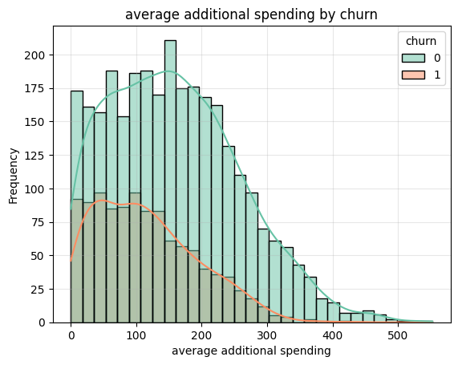
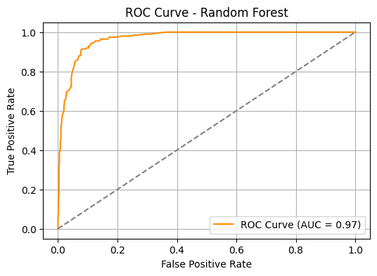

# 🏋️‍♂️ Gym User Churn Prediction with Machine Learning

This project employs machine learning techniques to forecast whether a gym user will discontinue their service. Through exploratory data analysis (EDA), feature engineering, and the training of classification models, the aim is to equip the business with a tool to **anticipate customer attrition** and facilitate proactive decision-making for enhanced retention.

---

## 📂 Project Contents

- Exploratory Data Analysis (EDA)
- Visualization of correlations and key insights
- Data cleaning and transformation
- Model training and evaluation
- Results interpretation
- Visualization of key metrics

---

## 📊 Key Visualizations

### **Contract Type vs. Retention**
> 📌 This visualization illustrates how retention varies based on the contract type.

  

### **Weekly Visits Distribution**
> 📌 This allows observation of the relationship between attendance frequency and the likelihood of cancellation.

  

### **Correlation Heatmap**
> 📌 This indicates the variables most correlated with membership cancellation.

  

### **Tenure vs. Retention**
> 📌 This highlights how the total time as a customer affects the probability of staying.

  

---

## 🤖 Machine Learning Models

Several models were trained and compared to predict user retention:

- **Logistic Regression**
- **Random Forest**

> 📈 The Random Forest model achieved notable accuracy, correctly identifying churn patterns with high reliability.

### 🎯 **ROC Curve - Random Forest**

  

### 🧮 **Confusion Matrix - Random Forest**

  

---

## 🧠 Key Findings

### 🤖 **User Clusters**

  

- **Model Used**: Random Forest
- **Accuracy**: 91%
- **Recall**: 81.3%
- **Precision**: 83.8%
- **AUC - ROC**: 0.97 (Excellent discrimination)

These results indicate that the model has a **strong capability to identify users likely to churn**, enabling more effective loyalty strategies.

---

## 🛠️ Tools Used

- Python 🐍
- Pandas, NumPy
- Matplotlib, Seaborn
- Scikit-learn
- Jupyter Notebook

---

## 📈 Potential Applications

- Customer segmentation by churn risk.
- Automation of alerts for the retention team.
- Impact analysis of promotions or operational changes.
- Data-driven improvement of customer experience.

---

## ✅ Conclusion

- Key factors predicting customer retention were identified.
- The predictive model can be implemented to flag potential future cancellations.
- This allows for the design of personalized retention strategies and improved customer experience.
- With this approach, the business can reduce its churn rate and improve long-term profitability.

---

## 👨‍💻 Author
Juan Cano
Data Analyst | Machine Learning Enthusiast
📧 jpcano983@gmail.com
🔗 [GitHub](https://github.com/Juancanoanalyst)
🔗 [LinkedIn](https://www.linkedin.com/in/juan-pablo-cano-chaparro/)
